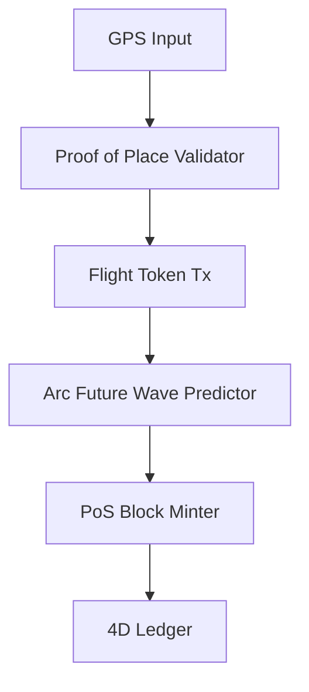

# 4D Geo Flight Blockchain: Token PoS System for Real-Time Positioning

## Overview
A Proof-of-Stake blockchain for tokenizing flights with real-time 4D geospatial tracking (lat, lon, alt, time). Uses "arc future wave" (arcsin/arccos/arctan) to predict and plot paths, enabling VTOL, proof-of-place, and time dilation fixes.

## Key Features
- Token-based flights: Each path is a transferable token with 4D metadata.
- PoS Consensus: Stake tokens for validation; GPS proofs for "place" challenges.
- Path Prediction: Trig-based forecasting for safe routing.
- VTOL Support: Corrects vertical time skew.
- Extensible: For drones, AR, etc.

## Quick Start
1. Clone: `git clone https://github.com/realtime4dgeo-design/4d-geo-flight-blockchain.git`
2. Build: `mkdir build && cd build && cmake .. && make`
3. Run: `./src/main` (mints genesis, starts node).
4. Test: `make test`

## Architecture

## Contributing
See Issue #1 for overhaul tracking. Fork, PR to dev.

## License
MIT

